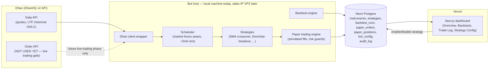

# Architecture

## Overview

## Components

- **Dhan client wrapper** (`bot/growmore_bot/broker/`): auth (daily access-token refresh), instrument
  lookup, historical OHLC, live quotes. Calls only Data API endpoints today.
- **Backtest engine** (`bot/growmore_bot/backtest/`): replays historical bars, computes Sharpe/
  drawdown/win-rate/profit-factor, persists results for the dashboard's Backtests page.
- **Paper trading engine** (`bot/growmore_bot/paper/`): on each scheduler tick, fetches live quotes
  for enabled (strategy, instrument) pairs, simulates a fill at LTP, updates positions/P&L, enforces
  risk guards (max position size, daily loss limit).
- **Scheduler** (`bot/growmore_bot/scheduler/`): market-hours-aware polling loop, not a tick-driven
  daemon — deliberately not HFT.
- **Dashboard** (`dashboard/`): Next.js on Vercel, reads the shared Postgres schema, writes only to
  `bot_config` (enable/disable toggles).
- **Database**: Neon Postgres, shared schema, bot owns migrations (Alembic).

## Deployment

- **Bot**: runs as a scheduled process on the owner's local machine for now. Moving to a static-IP
  VPS later requires no architecture change — just a new host + a static/elastic IP, since the bot
  already only makes outbound calls (no inbound listener).
- **Dashboard**: Vercel project, auto-deployed Preview on every push/PR via Vercel's GitHub
  integration; production promotion is a separate, explicitly confirmed step.
- **Database**: one Neon project for this app, isolated from other projects. Vercel Preview
  deployments get a real Neon preview branch via the Vercel↔Neon marketplace integration.

## Why not live trading yet

Two gates, both tracked in `docs/technical-debt.md`:
1. Dhan requires a static IP for Order API calls; the bot's current host doesn't have one.
2. SEBI requires an exchange-assigned Algo-ID on every API-placed order from 2026-04-01; not
   implemented.

Paper trading sidesteps both by never calling the Order API — trades are simulated locally against
real market data.
