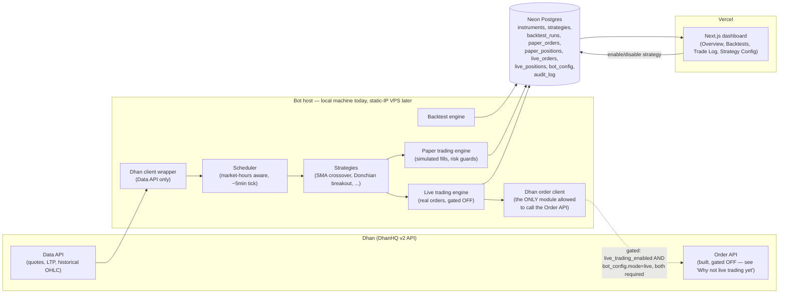

# Architecture

## Overview

## Components

- **Dhan client wrapper** (`bot/growmore_bot/broker/dhan_client.py`): auth (daily access-token
  refresh), instrument lookup, historical OHLC, live quotes. A hard runtime allow-list (`_SafeSdk`)
  blocks it from ever calling `place_order`/`modify_order`/`cancel_order` — Data API only, always.
- **Dhan order client** (`bot/growmore_bot/broker/dhan_order_client.py`): the ONLY module allowed to
  call Dhan's real Order API. Refuses every call unless `live_trading_enabled=True` (checked at call
  time), and writes an `audit_log` entry for every attempt, success or failure. Places `MARKET`
  orders with `productType="MARGIN"` (carry-forward, not `"INTRADAY"` which would auto-square-off
  same day and break every multi-day-holding strategy this bot runs) — schema confirmed against the
  installed `dhanhq` SDK's own source, not a scraped doc page.
- **Backtest engine** (`bot/growmore_bot/backtest/`): replays historical bars, computes Sharpe/
  drawdown/win-rate/profit-factor, persists results for the dashboard's Backtests page.
- **Paper trading engine** (`bot/growmore_bot/paper/`): on each scheduler tick, fetches live quotes
  for `mode="paper"` (strategy, instrument) pairs, simulates a fill at LTP, updates
  `paper_positions`/`paper_orders`, enforces risk guards (max position size, daily loss limit,
  pre-expiry close-out).
- **Live trading engine** (`bot/growmore_bot/live/`): mirrors the paper engine's interface and risk
  guards exactly, but for `mode="live"` pairs — a BUY/SELL signal calls the Dhan order client instead
  of simulating a fill, and persists to `live_positions`/`live_orders` (never the paper tables, so
  real and simulated data can never mix). Built and tested, but real order placement stays off end
  to end today — see "Why not live trading yet."
- **Scheduler** (`bot/growmore_bot/scheduler/`): market-hours-aware polling loop, not a tick-driven
  daemon — deliberately not HFT. Enforces `contract_rollover.py`'s pre-expiry close-out guard (mirrors
  Dhan's real MCX delivery rules, automatically rolling to the next contract month once validated
  against a live quote) before evaluating any strategy for a given config, and picks the paper or
  live engine per `bot_config.mode` — a `mode="live"` config is skipped entirely, never silently
  downgraded to paper, whenever the global `live_trading_enabled` flag is off.
- **Dashboard** (`dashboard/`): Next.js on Vercel, reads the shared Postgres schema, writes only to
  `bot_config` (enable/disable toggles). Does not yet read `live_positions`/`live_orders` or expose
  `bot_config.mode` — see docs/technical-debt.md.
- **Database**: Neon Postgres, shared schema, bot owns migrations (Alembic).

## Deployment

- **Bot**: runs as a scheduled process on the owner's local machine for now. Moving to a static-IP
  VPS later requires no architecture change — just a new host + a static/elastic IP, since the bot
  already only makes outbound calls (no inbound listener).
- **Dashboard**: Vercel project, auto-deployed Preview on every push/PR via Vercel's GitHub
  integration; production promotion is a separate, explicitly confirmed step.
- **Database**: one Neon project for this app, isolated from other projects. Vercel Preview
  deployments get a real Neon preview branch via the Vercel↔Neon marketplace integration.

## Why not live trading yet

The real order-placement path (`dhan_order_client.py` + `live/engine.py` + `bot_config.mode`) is
built and tested (2026-09-04), but stays off end to end. Two independent gates both have to be
explicitly opened before any real order can be placed — `LIVE_TRADING_ENABLED` (global, an env var,
off by default) and a specific `bot_config.mode="live"` (per strategy/instrument pair, set directly
in the database — there's no dashboard UI for this, deliberately, so switching a config to live
trading is never an accidental checkbox click) — and even then, real infrastructure gaps remain,
tracked in `docs/technical-debt.md`/`docs/pending-actions.md`:
1. Dhan requires a static IP for Order API calls; the bot's current host doesn't have one (VPS move
   deferred by the account owner as of 2026-09-04).
2. Dhan's specific 2FA/OAuth-based API session requirements for retail algo access haven't been
   confirmed directly with Dhan yet (SEBI's Algo-ID *registration* itself is expected to be exempt
   for this bot's low order rate, per `docs/technical-debt.md`).
3. No reconciliation exists yet between `live_positions`/`live_orders` and Dhan's own real order/
   position state — a `MARKET` order's initial response only carries an order ID and status like
   `"TRANSIT"`, not a confirmed fill price, so `live_positions.avg_entry_price` is presently an
   approximation (the tick's live quote LTP), not a verified fill.
4. Tripping the daily-loss-limit guard on a live config disables the bot_config but does not
   automatically place a closing order for whatever's still open — that needs a human to look at it.

Paper trading sidesteps all of this by never calling the Order API — trades are simulated locally
against real market data.
