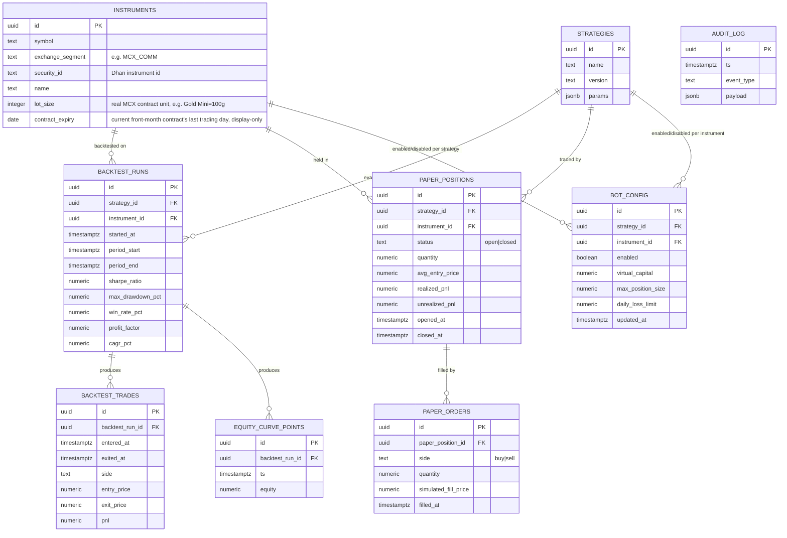

# Database Schema (Neon Postgres)

One shared schema, migrations owned by `bot/` (Alembic). The dashboard reads directly; its only
writes are enable/disable toggles into `bot_config`.

## Notes

- `audit_log` records every action that could plausibly matter for a future compliance review:
  strategy enable/disable, risk-guard trips, and (once live trading exists) every real order call.
- `bot_config` is the single gate between "backtested" and "paper trading live" — nothing runs
  without an explicit enabled row.
- Money/price columns are `numeric`, never floating point.
