# Database Schema (Neon Postgres)

One shared schema, migrations owned by `bot/` (Alembic). The dashboard reads directly; its only
writes are enable/disable toggles into `bot_config`.

```mermaid
erDiagram
    INSTRUMENTS ||--o{ BACKTEST_RUNS : "backtested on"
    INSTRUMENTS ||--o{ PAPER_POSITIONS : "held in"
    STRATEGIES ||--o{ BACKTEST_RUNS : "evaluated by"
    STRATEGIES ||--o{ PAPER_POSITIONS : "traded by"
    BACKTEST_RUNS ||--o{ BACKTEST_TRADES : "produces"
    BACKTEST_RUNS ||--o{ EQUITY_CURVE_POINTS : "produces"
    STRATEGIES ||--o{ BOT_CONFIG : "enabled/disabled per instrument"
    INSTRUMENTS ||--o{ BOT_CONFIG : "enabled/disabled per strategy"
    PAPER_POSITIONS ||--o{ PAPER_ORDERS : "filled by"
    STRATEGIES ||--o{ LIVE_POSITIONS : "traded by"
    INSTRUMENTS ||--o{ LIVE_POSITIONS : "held in"
    LIVE_POSITIONS ||--o{ LIVE_ORDERS : "filled by"
    BOT_CONFIG ||--o| BOT_SIGNAL_STATE : "current signal for"

    INSTRUMENTS {
        uuid id PK
        text symbol
        text exchange_segment "e.g. MCX_COMM"
        text security_id "Dhan instrument id"
        text name
        integer lot_size "quote-units per lot, e.g. Copper=2500 (kg, quoted per kg); GOLDM=10 (100g lot, quoted per 10g)"
        date contract_expiry "current front-month contract's last trading day, display-only"
    }
    STRATEGIES {
        uuid id PK
        text name
        text version
        jsonb params
    }
    BACKTEST_RUNS {
        uuid id PK
        uuid strategy_id FK
        uuid instrument_id FK
        timestamptz started_at
        timestamptz period_start
        timestamptz period_end
        numeric sharpe_ratio
        numeric max_drawdown_pct
        numeric win_rate_pct
        numeric profit_factor
        numeric cagr_pct
    }
    BACKTEST_TRADES {
        uuid id PK
        uuid backtest_run_id FK
        timestamptz entered_at
        timestamptz exited_at
        text side
        numeric entry_price
        numeric exit_price
        numeric pnl
    }
    EQUITY_CURVE_POINTS {
        uuid id PK
        uuid backtest_run_id FK
        timestamptz ts
        numeric equity
    }
    PAPER_POSITIONS {
        uuid id PK
        uuid strategy_id FK
        uuid instrument_id FK
        text status "open|closed"
        numeric quantity
        numeric avg_entry_price
        numeric realized_pnl
        numeric unrealized_pnl
        timestamptz opened_at
        timestamptz closed_at
    }
    PAPER_ORDERS {
        uuid id PK
        uuid paper_position_id FK
        text side "buy|sell"
        numeric quantity
        numeric simulated_fill_price
        timestamptz filled_at
        numeric pnl "realized P&L this sell fill locked in, null for buys"
    }
    LIVE_POSITIONS {
        uuid id PK
        uuid strategy_id FK
        uuid instrument_id FK
        text status "open|closed"
        numeric quantity
        numeric avg_entry_price "approximate -- see LiveTradingEngine docstring"
        numeric realized_pnl
        numeric unrealized_pnl
        timestamptz opened_at
        timestamptz closed_at
    }
    LIVE_ORDERS {
        uuid id PK
        uuid live_position_id FK
        text side "buy|sell"
        numeric quantity
        text broker_order_id "Dhan's real orderId"
        text order_status "Dhan's orderStatus (e.g. TRANSIT)"
        numeric fill_price "approximate -- the tick's quote LTP, not a confirmed fill"
        timestamptz filled_at
        numeric pnl
    }
    BOT_CONFIG {
        uuid id PK
        uuid strategy_id FK
        uuid instrument_id FK
        boolean enabled
        numeric max_position_size
        numeric daily_loss_limit
        text mode "paper (default) | live -- see CLAUDE.md non-negotiables"
        boolean pending_auto_close "set when a real auto-close order failed; retried with backoff"
        integer auto_close_retry_count
        timestamptz auto_close_next_retry_at
        timestamptz updated_at
    }
    BOT_SIGNAL_STATE {
        uuid id PK
        uuid bot_config_id FK "unique -- one row per config, upserted every tick"
        text last_signal "HOLD|BUY|SELL"
        timestamptz checked_at
        numeric ltp
        numeric prev_close "previous trading day's close, for today's %% change"
        numeric daily_pnl "today's cumulative realized P&L for the daily_loss_limit guard"
        jsonb indicators "Strategy.debug_state(), display-only"
        jsonb crossing_state "Strategy.get_state_snapshot(), restored after warm-up each tick"
        timestamptz last_max_position_rejection_logged_at "throttles repeat audit_log entries to 1/30min"
    }
    BOT_STATUS {
        uuid id PK "singleton row"
        boolean live_trading_enabled
        timestamptz last_tick_at
        numeric available_balance "Dhan real fund balance"
        numeric utilized_margin
    }
    AUDIT_LOG {
        uuid id PK
        timestamptz ts
        text event_type
        jsonb payload
    }

    STRATEGIES ||--o{ WHEEL_BASKET_CONFIGS : "one config manages a rotating basket"
    WHEEL_BASKET_CONFIGS ||--o{ WHEEL_BASKET_POSITIONS : "one row per (config, symbol)"
    WHEEL_BASKET_CONFIGS ||--o{ WHEEL_BASKET_SELECTIONS : "one row per candidate per cycle"
    WHEEL_BASKET_POSITIONS ||--o{ WHEEL_BASKET_LEGS : "one row per option leg written/settled"

    STRATEGIES ||--o{ MCX_OPTIONS_CONFIGS : "one config per commodity (GOLDM/SILVERM)"
    MCX_OPTIONS_CONFIGS ||--o{ MCX_OPTIONS_POSITIONS : "one row per position lifecycle"
    MCX_OPTIONS_CONFIGS ||--o{ MCX_OPTIONS_SELECTIONS : "one row per cycle date"
    MCX_OPTIONS_POSITIONS ||--o{ MCX_OPTIONS_LEGS : "one row per option leg / state transition"

    WHEEL_BASKET_CONFIGS {
        uuid id PK
        uuid strategy_id FK
        boolean enabled
        text mode "paper (only mode that exists -- no live options path yet)"
        numeric total_virtual_capital "one pool, divided dynamically across eligible symbols"
        numeric top_iv_frac "fraction of the universe eligible by IV rank, default 0.33"
        numeric rotation_hysteresis_pct "min score edge a challenger needs to trigger a rotation"
        jsonb call_basis_buffer_tiers "RSI -> basis-buffer %, default [[60,0.05],[40,0.02],[0,0]]"
        timestamptz updated_at
    }
    WHEEL_BASKET_POSITIONS {
        uuid id PK
        uuid config_id FK
        text symbol "no instruments row -- NSE F&O options aren't in that MCX-shaped table"
        text status "open|closed"
        text state "short_put|holding_shares|short_call|flat"
        numeric basis "assignment strike, null until assigned"
        numeric shares
        numeric lots
        timestamptz opened_at
        timestamptz closed_at
        numeric realized_pnl
        numeric unrealized_pnl
    }
    WHEEL_BASKET_LEGS {
        uuid id PK
        uuid position_id FK
        date cycle_expiry
        text opt_type "PE|CE"
        numeric strike
        numeric premium
        numeric lots
        text action "sell_put|sell_call"
        timestamptz opened_at
        timestamptz settled_at
        boolean assigned
        boolean called_away
        numeric pnl
    }
    WHEEL_BASKET_SELECTIONS {
        uuid id PK
        uuid config_id FK
        date cycle_date
        text symbol
        boolean selected "every candidate considered gets a row, not just the winner"
        numeric avg_iv
        numeric iv_percentile "the validated selection metric, docs/stock-options-results.md Sec 7.1"
        numeric rsi "recorded for transparency -- not part of the selection score"
        boolean macd_bullish
        numeric score "== iv_percentile"
        text reason "human-readable, rendered directly as prose on the dashboard"
        timestamptz created_at
    }

    MCX_OPTIONS_CONFIGS {
        uuid id PK
        uuid strategy_id FK
        boolean enabled
        text mode "paper (only mode that exists -- no live options path yet)"
        text symbol "GOLDM|SILVERM -- one config row per commodity, no rotation"
        integer lots
        numeric consolidating_target_delta "default 0.30"
        numeric trend_favorable_target_delta "default 0.50"
        integer min_open_interest
        numeric margin_multiple_of_premium "flat reporting placeholder, never gates a trade"
        timestamptz updated_at
    }
    MCX_OPTIONS_POSITIONS {
        uuid id PK
        uuid config_id FK
        text status "open|closed"
        text state "flat|long_futures|closed"
        numeric basis "assigned put's RAW STRIKE, not premium-adjusted; null until assigned"
        numeric futures_qty "lots x lot_size"
        date futures_contract_expiry "current futures contract month backing the position, may roll"
        timestamptz opened_at
        timestamptz closed_at
        numeric realized_pnl
        numeric unrealized_pnl "marked daily while LONG_FUTURES is held"
    }
    MCX_OPTIONS_LEGS {
        uuid id PK
        uuid position_id FK
        date cycle_expiry "the option's own expiry"
        text opt_type "PE|CE"
        numeric strike
        numeric premium
        numeric lots
        text action "sell_put|assigned|sell_call|call_expired_otm|called_away|roll|put_expired_otm"
        timestamptz opened_at
        timestamptz settled_at
        boolean assigned
        boolean called_away
        numeric pnl
    }
    MCX_OPTIONS_SELECTIONS {
        uuid id PK
        uuid config_id FK
        date cycle_date "UNIQUE with config_id (0026) -- one cycle date is one decision"
        text regime "consolidating|trend_favorable|trend_unfavorable|null (no opinion)"
        numeric target_delta
        numeric selected_strike
        text reason "human-readable, rendered directly as prose on the dashboard"
        numeric futures_price
        text position_state
        numeric position_basis
        numeric position_unrealized_pnl
        jsonb candidates_considered
        date option_expiry
        timestamptz created_at
    }
```

## Notes

- `audit_log` records every action that could plausibly matter for a future compliance review:
  strategy enable/disable, risk-guard trips, contract rollovers, and every real order call attempt
  (`live_order_placed`/`live_order_failed`) — success or failure, always, per
  `growmore_bot/broker/dhan_order_client.py`.
- `bot_config` is the gate between "backtested" and "trading live" — nothing runs without an
  explicit `enabled` row, and a real order additionally requires `mode = "live"` on that row AND
  `Settings().live_trading_enabled = True` globally (`LIVE_TRADING_ENABLED` env var, off by default,
  still off as of 2026-09-04 — see docs/pending-actions.md before ever turning it on).
- `live_positions`/`live_orders` mirror `paper_positions`/`paper_orders` exactly (plus
  `broker_order_id`/`order_status` on `live_orders`) but are kept as fully separate tables so real
  and simulated trading data can never be confused with each other, in the database or on the
  dashboard. The dashboard reads both, filterable by a paper/live mode toggle on every page.
- `bot_signal_state` and `bot_status` are operational/display state, not user configuration — the
  former is one row per `bot_config` (what did the strategy just see), the latter a single
  process-wide singleton (is the bot armed, when did it last tick, current Dhan fund balance).
  Neither is written by the dashboard; both are upserted by the scheduler every tick.
- Money/price columns are `numeric`, never floating point.
- `wheel_basket_configs` plays `bot_config`'s gating role for the IV-rich stock-basket wheel
  strategy (`docs/stock-options-results.md`), but at a different grain: one config manages a
  *rotating basket of many symbols*, not one `(strategy, instrument)` pair, so it has no
  `instrument_id` and its positions/legs are keyed by `symbol` text directly rather than an
  `instruments` row (that table is MCX/Dhan-security-id shaped; NSE F&O stock options have no
  equivalent row today). `mode` only ever has the value `"paper"` — no live options order-placement
  path exists yet, unlike `bot_config.mode`, which genuinely supports `"live"`.
- `mcx_options_configs` is the direct MCX analog of `wheel_basket_configs`, but there is no
  cross-sectional universe/rotation concept for Goldmini/Silvermini options — one config row per
  commodity (`symbol` = `GOLDM`/`SILVERM`), sized in `lots` rather than a shared virtual-capital
  pool. Unlike the stock wheel (which settles into `shares`), an assigned put here settles into a
  `LONG_FUTURES` position (`futures_qty`) with its own `futures_contract_expiry` independent of the
  option's expiry, which may need rolling before the covered-call cycle resolves — tracked via the
  `roll` leg action. `basis` keeps the same convention as `wheel_basket_positions.basis`: the raw
  assignment strike, never premium-adjusted. There is no stop-loss anywhere in this state machine by
  deliberate design (`bot/research/mcx_options/engine.py`'s module docstring) — a position only ever
  closes via expiry, assignment, or being called away. `mode` is likewise `"paper"`-only for now.
- **Migrations 0026/0027 (independent code review, 2026-09-15).** The four `mcx_options_*` tables
  originally shipped with no indexes and no constraints beyond PK/FK. `0026_mcx_options_guards`
  adds indexes on the predicates the engine and dashboard actually query
  (`selections(config_id, cycle_date, created_at)`, `positions(config_id, opened_at)`,
  `legs(position_id)`); `UNIQUE (config_id, cycle_date)` on `mcx_options_selections` — one cycle
  date is one decision, and a re-run now replaces that day's row rather than appending another
  (three hand-run cycles on 2026-09-14 each left their own); partial unique indexes enforcing **at
  most one open position per config** and **at most one unsettled leg per position** (the engine
  previously used `.first()` for the former, silently orphaning the second, and `.one_or_none()`
  for the latter, whose bare `MultipleResultsFound` wedged that commodity every day thereafter);
  `UNIQUE (strategy_id, symbol)` on `mcx_options_configs`; and CHECK constraints pinning the
  closed-set text columns — `status`, `state`, `opt_type`, `action`, `regime`, and **`mode`, the
  live-trading gate, which was unconstrained free text**. A further CHECK ties 0023's
  `strike`/`premium` nullability to the only rows entitled to it
  (`(opt_type IN ('ROLL','STOP')) = (strike IS NULL)`). The upgrade de-duplicates existing
  selection rows before adding the unique constraint.
  `0027_mcx_options_risk_flags` then adds the default-OFF risk/selection columns described in
  `docs/pending-actions.md` and widens the leg CHECKs to admit a `STOP` leg.
