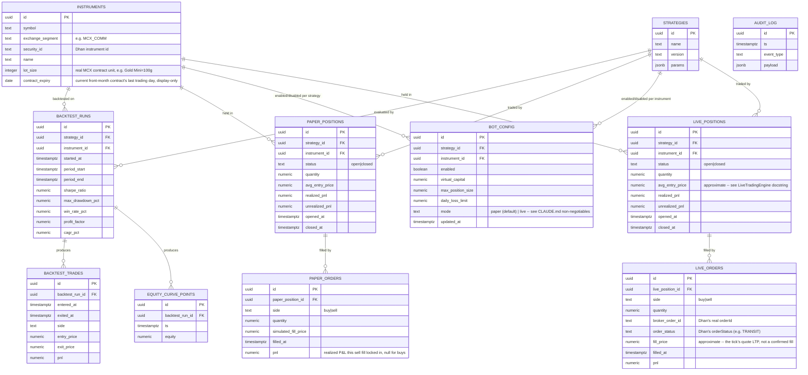

# Database Schema (Neon Postgres)

One shared schema, migrations owned by `bot/` (Alembic). The dashboard reads directly; its only
writes are enable/disable toggles into `bot_config`.

## Notes

- `audit_log` records every action that could plausibly matter for a future compliance review:
  strategy enable/disable, risk-guard trips, contract rollovers, and every real order call attempt
  (`live_order_placed`/`live_order_failed`) — success or failure, always, per
  `growmore_bot/broker/dhan_order_client.py`.
- `bot_config` is the gate between "backtested" and "trading live" — nothing runs without an
  explicit `enabled` row, and a real order additionally requires `mode = "live"` on that row AND
  `Settings().live_trading_enabled = True` globally (`LIVE_TRADING_ENABLED` env var, off by default,
  still off as of 2026-09-04 — see docs/pending-actions.md before ever turning it on).
- `live_positions`/`live_orders` mirror `paper_positions`/`paper_orders` exactly (plus
  `broker_order_id`/`order_status` on `live_orders`) but are kept as fully separate tables so real
  and simulated trading data can never be confused with each other, in the database or on the
  dashboard. The dashboard does not read these tables yet — see docs/technical-debt.md.
- Money/price columns are `numeric`, never floating point.
